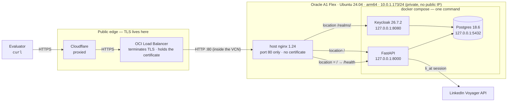
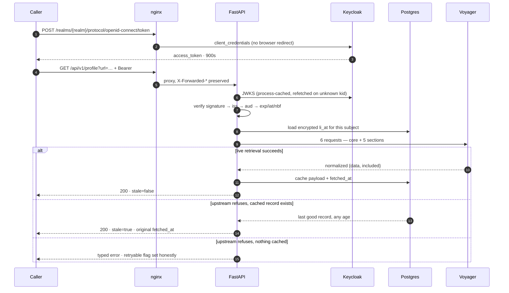
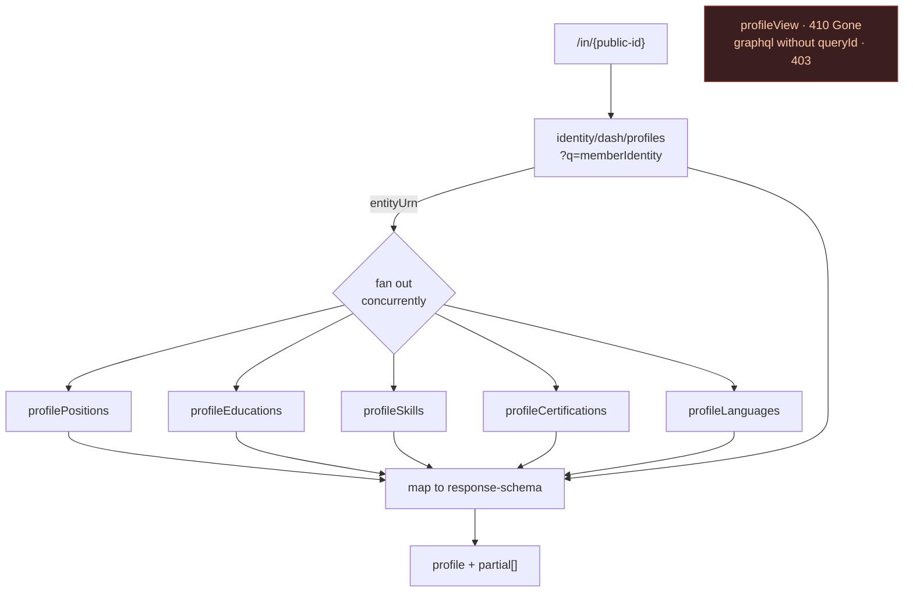
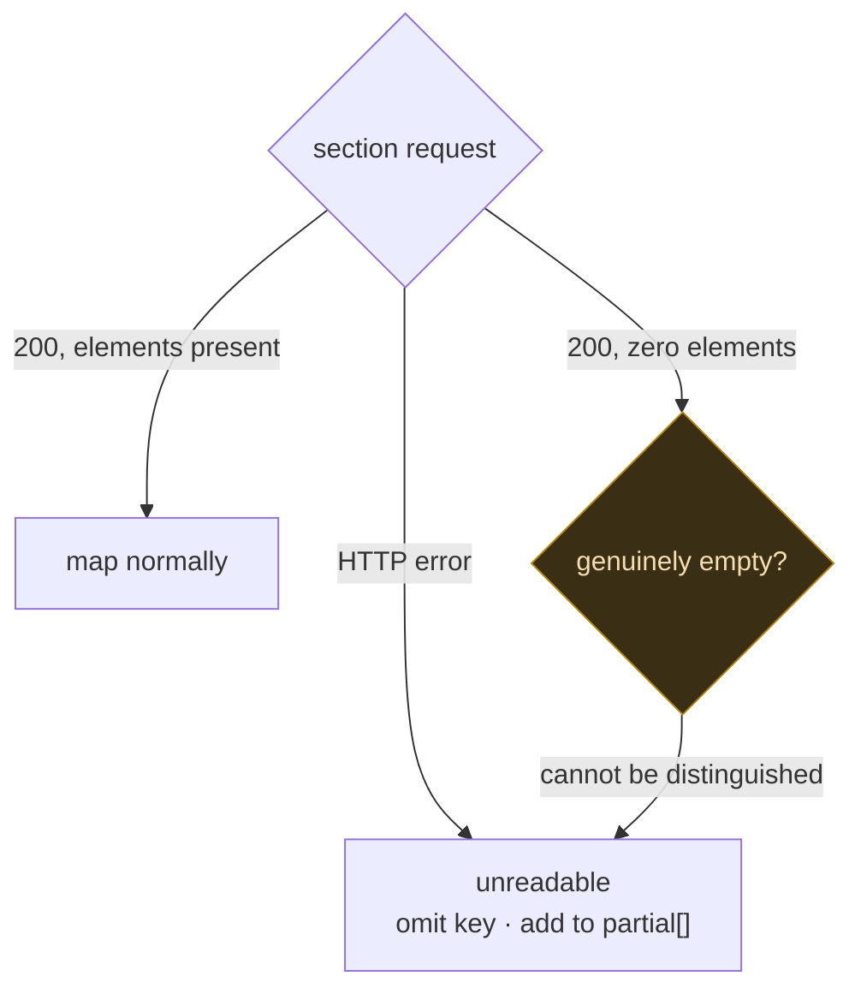
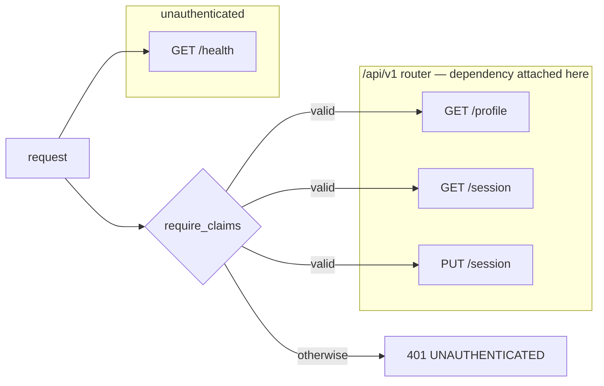

# Architecture

Diagrams render natively on GitHub. Everything shown as built is verified running; everything shown as pending is named as such rather than drawn optimistically.

## Deployment topology

The instance holds **no public IP**. The load balancer is the only public path, and nginx is the only process on the host that listens off-loopback — every application container binds `127.0.0.1`.

**TLS terminates at the load balancer**, which holds the certificate. nginx therefore holds none and listens on port 80 only — and host `iptables` opens 80 and *not* 443, which matches exactly. The one plaintext hop is load balancer → instance, inside the OCI VCN rather than across the public internet.

This is why nginx must **not** redirect to HTTPS: it sees `http` on a request the client made over HTTPS, so a scheme-based redirect loops forever. Cloudflare handles `http://` → `https://` at the edge.

`/admin/` is intentionally **not** proxied. The Keycloak admin console is reachable only over an SSH tunnel.

## Request flow

Two `curl` commands are what CAP-3 is graded on: mint a token, then call the endpoint.

Step 8 is the load-bearing one: **a profile costs six upstream calls, not one.** The core entity carries only `experienceCardUrn` and `educationCardUrn` pointers, so each section is its own request. That multiplies rate-limit exposure sixfold per API call and is the strongest argument for stale-serve.

## Retrieval fan-out

`profileView` — the endpoint most published guidance still recommends — returns **410 Gone**. The map above was measured against the live API, not recalled.

A section failing degrades rather than aborts: it is omitted from the payload and named in `partial[]`. Only a core-profile failure fails the whole fetch.

## Absent versus unreadable

The distinction `response-schema.md` calls load-bearing, and the easiest thing in this system to get quietly wrong.

Measured: `profileLanguages` returned **0 elements** on one call and **3** on an identical call minutes later — HTTP 200, no error, both times. So a zero-length section is *not* evidence the profile lacks that data. Mapping empty → `[]` would publish "this person speaks no languages" as fact. It belongs in `partial[]`.

## Authentication boundary

Auth attaches to the **router**, not to individual routes, so a later route inherits protection whether or not its author remembered it. A test asserts this by mounting a route that declares no dependency of its own and requiring it to 401 — removing the router dependency fails three tests.

`/health` stays outside `/api/v1` because the container healthcheck has no token to present.

## Build status

| # | Story | State |
|---|---|---|
| 1 | Skeleton, env config, local parity | Done |
| 2 | Deploy through LB and nginx | **Done** — live at https://shreyaskaushik.dpdns.org |
| 3 | Keycloak realm, clients, JWT validation | Done |
| 4 | Voyager client, raw JSON | In progress |
| 5 | Encrypted per-user session vault | Pending |
| 6 | Profile extraction and schema mapping | Pending — the graded core |
| 7 | Response cache with stale-serve | Pending |
| 8 | Error taxonomy and handlers | Pending |
| 9 | README, secret audit, final deploy | Pending |

## Decisions worth knowing

| Decision | Why |
|---|---|
| Per-user BYO `li_at` rather than one owner account | One lockout would otherwise take the whole service down during evaluation |
| Voyager JSON, never rendered HTML | HTML is authwalled and truncated for datacenter IPs; the API is the literal task |
| Stale-serve unbounded — no TTL, no eviction | The service is graded on still answering. A record of any age beats an error |
| Keycloak `start`, never `start-dev` | Local and deployed must differ by env alone, never by command |
| TLS terminates at the load balancer | Cloudflare→LB is encrypted; the only plaintext hop is LB→instance inside the private VCN, never the public internet |
| Load-balancer health check probes `GET /`, proxied to `/health` | The check must be *truthful*: 200 only while the API really answers. A static 200 would report a dead backend as healthy |
| 428 for missing/expired session | The caller has a fixable missing precondition, which is exactly what 428 means |
